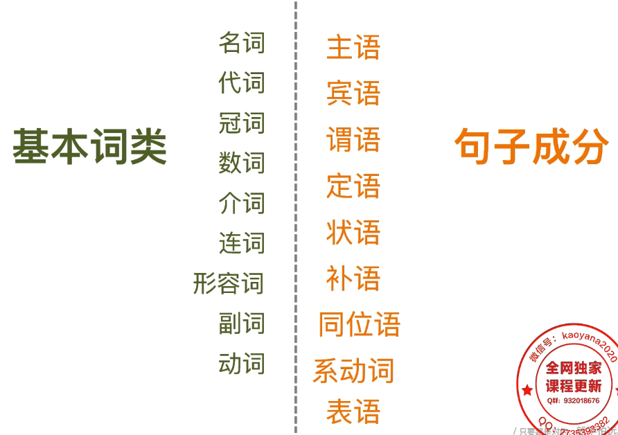
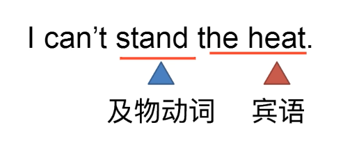
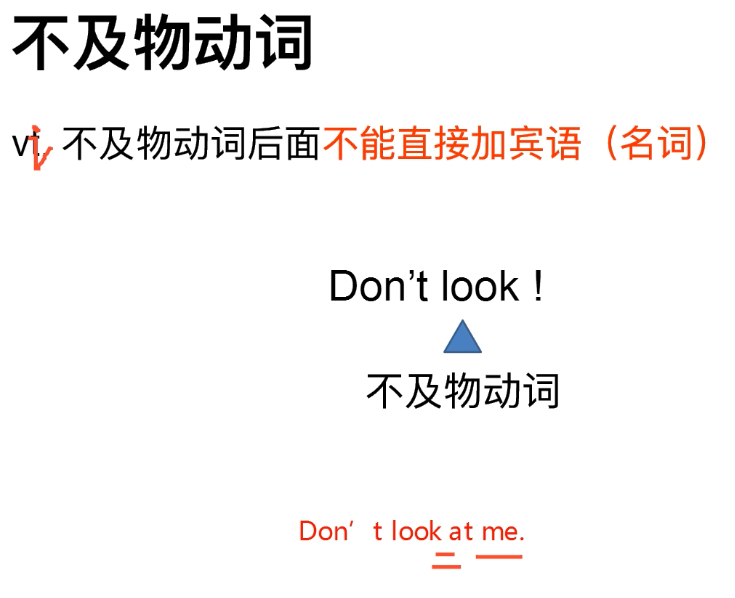
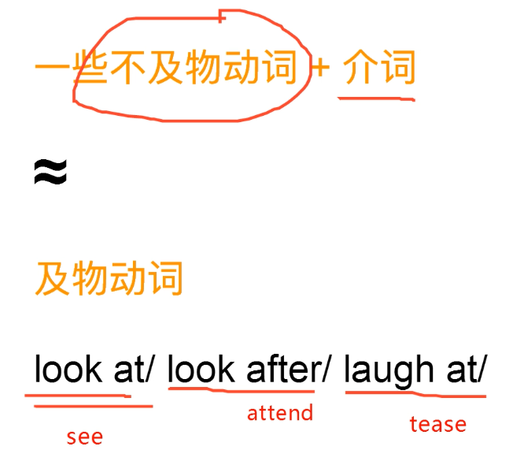
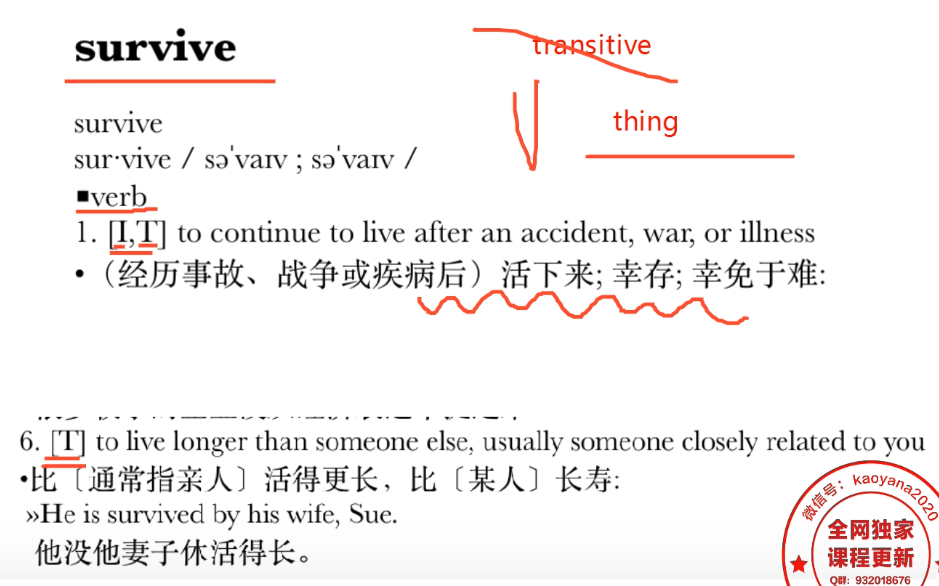

语法是什么？

语言的法则，规则。




不同词性之间的修饰关系


形容词修饰名词    ....的  名词就是 东西

副词 修饰动作    .... 地  快块地跑 轻轻地 跑

副词 修饰形容词   

副词 修饰副词   谜之疯狂地喜欢


石雷鹏 喜欢 伊延


形容词修饰名词：皮肤黝黑的  修饰 石雷鹏  喜欢有一颗少女心 修饰 伊延

**皮肤黝黑的**石雷鹏 **喜欢有一颗少女心**的伊延。


副词 修饰动词：`疯狂地` 修饰 喜欢

**皮肤黝黑的**石雷鹏 `疯狂地喜欢`**有一颗少女心**的伊延。


副词 修饰副词：谜之 `修饰` `疯狂地喜欢`

**皮肤黝黑的**石雷鹏 `谜之` `疯狂地喜欢`**有一颗少女心**的伊延。


词与词之间的修饰关系？

```

Tom runs  very fast.   fast 修饰跑  very 修饰 fast 
名词  动词    副词 副词   


She is an extremely beautiful girl.    副词修饰形容词 形容词修饰名词
           副词     形容词    名词

I like hotpot very much.    very much 副词 修饰 like 动词

   动词   名词  副词

```


动词 ：


实义动词：有具体实际具体动作  ： 及物动词 、不及物动词


非实义动词： 助动词
            情态动词
            系动词


及动物动词 后面必须加宾语 （名词）





不及动物动词：
1.不加名词、宾语
2.后面加介词+名词 

句子成分之间的修饰关系？








有的词既可以当及物动词也也可以当不及物动词。

I am studying 

不及物动词


I am studying English
及物动词


He survived 
他活下来了

He survived his wife 
他比他妻子活得长





助动词：

当动词没有办法实现某个功能的时候，需要助动词辅助一下


![助动词](images/助动词.png）

![助动词2](images/助动词2.png）

be hired by 构成被动语态


![助动词3](images/助动词3.png）

表现疑问 帮助构成疑问


![助动词4](images/助动词4.png）

构成否定


My father `is watching` a football match.
进行事态


Thy boy `doesn't` like to stand here.


情态动词：


![情态动词](images/情态动词.png）

表示语句中的许可

可以吧  可以吗？ 你必须 


![情态动词2](images/情态动词2.png）


情态动词 ———— 照妖镜

情态动词后用动词原形


The baby `can` talk 


 Go and ask Mr.Wang . He `may` know the telephone number.


 什么时候be是系动词？ 


![什么使用有系动词什么时候用助动词](images/什么使用有系动词什么时候用助动词.png）

![系动词与助动词使用条件](images/系动词与助动词使用条件.png）


句子里有助动词出现的使用谁是谓语呢？


助动词 + 后面的doing /done  = 谓语


![句子中有助动词出现时谁是谓语呢](images/句子中有助动词出现时谁是谓语呢.png）


系动词： 联系动词 link verb  相当于=号


Brad Pitt `is` an actor  把句子前后连接起来


Yes,it `is` a dog.

Lady Gaga `looks` funny.


![系动词种类](images/系动词种类.png）


The apple `goes` bad .

The leaves `turn` yellow .


It `turns out` sunny


1.The cake `tastes` delicious 


2. The baby `is crying`


3. Tom's homework `was finished` by Jerry.
4. `I am going to finish` my homework

be going to = will 

5. I `don't know` what to do .
6. I `like` the boy standing over there.
7. The Spanish case `provides` arguments both for and against monarchy.
8. Terrorism ,economic uncertainties and general fellings of insecurity `heve increased` people's anxiety

